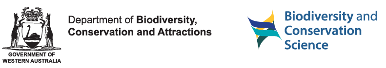

# Authors and Citation

## Authors

- **Florian W. Mayer**. Author, maintainer.
  

- **[Maëlle Salmon](https://masalmon.eu)**. Reviewer.
  

- **Karissa Whiting**. Reviewer.
  

- **Jason Taylor**. Reviewer.

- **Marcelo Tyszler**. Contributor.
  

- **Hélène Langet**. Contributor.
  

- ****.
  Copyright holder, funder.

- ****.
  Funder.

## Citation

Source:
[`inst/CITATION`](https://github.com/ropensci/ruODK/blob/HEAD/inst/CITATION)

Mayer, Florian Wendelin. (2020, Nov 19). ruODK: An R Client for the ODK
Central API (Version X.X.X). Zenodo.
https://doi.org/10.5281/zenodo.5559164

    @Misc{,
      title = {ruODK: Client for the ODK Central API},
      author = {Florian W. Mayer},
      note = {R package version X.X.X},
      year = {2020},
      url = {https://github.com/ropensci/ruODK},
    }
